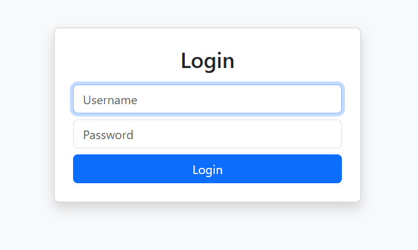
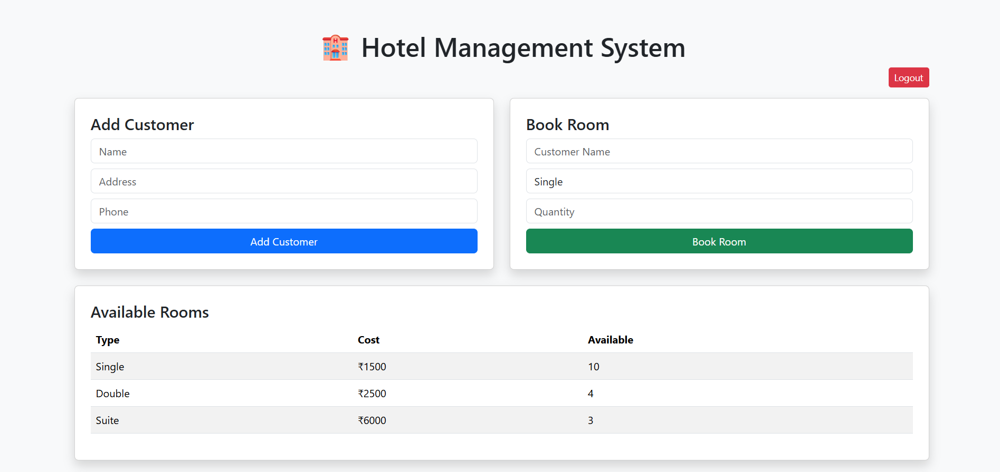
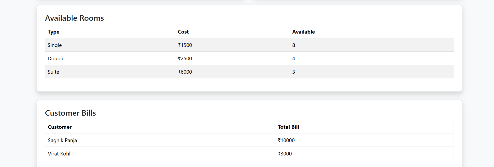

[](https://python-hotel-management-system-1.onrender.com)


# 🏨 Hotel Management System (Web App)

A modern web-based Hotel Property Management System built with Flask and SQLite.  
This system automates customer management, room booking, and billing operations in a clean dashboard interface.

🔗 Live Demo: https://python-hotel-management-system-1.onrender.com

---

## Features

- Secure admin login
- Customer registration
- Room booking system
- Real-time room availability tracking
- Automatic billing engine
- Persistent SQLite database
- Responsive Bootstrap UI
- Cloud deployment ready

---

## Tech Stack

- Python (Flask)
- SQLite
- Bootstrap 5
- Gunicorn
- Render Cloud Hosting

---

## Screenshots





---

## Architecture

Modular Flask application with layered structure:

```
app/
├── main.py        # Flask routes
├── database.py    # DB connection
├── init_db.py     # Schema setup
└── templates/     # UI templates
```

---

## Run locally

```bash
pip install -r requirements.txt
python -m app.main
```

Open:

http://127.0.0.1:5000

Login:

```
admin / admin123
```

---

## Deployment

Hosted on Render using Gunicorn.

Production command:

```
gunicorn app.main:app
```

---

## Author

Built as a full-stack portfolio project demonstrating backend architecture, authentication, and deployment workflow.
